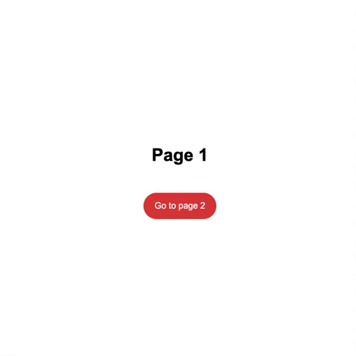

# Swup Stripes Overlay Theme

<div style="text-align:center">
  
</div>

This is a theme for [swup](https://swup.js.org/) - complete, flexible, extensible and easy to use page transition library for your web.

## Installation

This theme can be installed with npm

```bash
npm install swup-stripes-overlay-theme
```

and included with import

```javascript
import SwupStripesOverlayTheme from 'swup-stripes-overlay-theme';
```

or included from the dist folder

```html
<script src="./dist/SwupStripesOverlayTheme.js"></script>
```

## Usage

To run this theme, include an instance in the swup options.

```javascript
const swup = new Swup({
  theme: [new SwupStripesOverlayTheme()]
});
```

## Options

### Colors

Change the colors of the different stripes with the variables color1, color2, color3 and color4.
The default colors are :

```
color1: '#5513FF',
color2: '#E40059',
color3: '#F07700',
color4: '#F8EE00',
```

### Duration

The duration of the animation.

### Default options

```javascript
const defaultOptions = {
  color1: '#5513FF',
  color2: '#E40059',
  color3: '#F07700',
  color4: '#F8EE00',
  duration: 400
};
```
